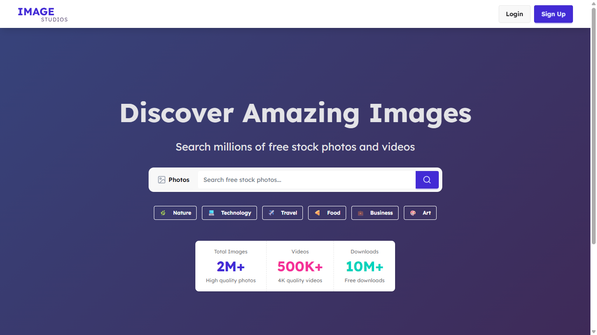

# 🖼️ Image Studios – Free Stock Photos and Videos

A fully functional and scalable **Next.js** application that lets users explore, search, and download **millions of free stock photos and videos** powered by the **Pexels API**.  
This project also integrates **authentication with Clerk**, providing secure login options via **Google** and **GitHub**.



---

## 🧩 Tech Stack

- **Next.js 15** – React framework for SSR and performance  
- **Pexels API** – For fetching high-quality photos and videos  
- **Clerk Auth** – Authentication with Google & GitHub  
- **React** – UI components  
- **DaisyUI** – Tailwind CSS UI component library  

---

## ✨ Features

- 🔐 Authentication with **Clerk** (Google & GitHub)
- 📸 Browse and **Download Photos & Videos**
- 🔍 Smart **Search with Suggestions**
- 🖥️ Responsive and **Optimized Layout**
- ⚡ Server-Side Rendering (SSR) & Caching
- 🔁 **Route Interception** for smooth navigation
- 🔎 **SEO Optimized** with Next.js metadata
- 📱 Fully responsive across devices

---

## ⚙️ How to Run Locally

Follow the steps below to set up the project on your local machine.

### 1. Clone the Repository

```bash
git clone https://github.com/alihassnain-github/image-studios
```

Then navigate into the project directory:

```bash
cd image-studios
```

---

### 2. Install Dependencies

Make sure you have **Node.js (>=20)** installed.

Then run:

```bash
npm install
# or
yarn install
```

---

### 3. Create the `.env.local` File

Copy the contents of the provided `.env.example` file and rename it to `.env.local` in the root directory.

```bash
cp .env.example .env.local
```

---

### 4. Add Environment Variables

You’ll need to set up your **API keys** and **Clerk credentials**.

#### 🔑 Pexels API Key
- Visit [Pexels API Dashboard](https://www.pexels.com/api/)  
- Create an account or log in  
- Generate your **API Key**

#### 🔐 Clerk Keys
- Go to [Clerk Dashboard](https://dashboard.clerk.com/)  
- Create a new project  
- Copy your **Publishable Key** and **Secret Key**

Paste your keys into `.env.local`

---

### 5. Run the Development Server

Start the local server with:

```bash
npm run dev
# or
yarn dev
```

Then open the app in your browser:

👉 [http://localhost:3000](http://localhost:3000)

---

---

## ✅ Conclusion

**Image Studios** is a complete, production-ready photo and video browsing platform that demonstrates how to integrate APIs, authentication, and SSR optimization in a modern **Next.js** app.  
You can easily extend it with custom filters, user collections, or cloud storage integration.

If you find this useful, consider ⭐ **starring the repo** to support the project!

---

**Author:** [Ali Hasnain](https://github.com/<your-username>)  
**License:** MIT  
